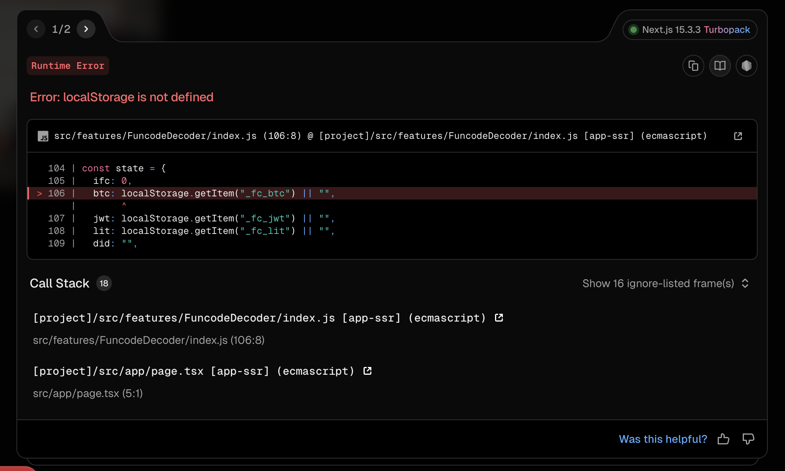
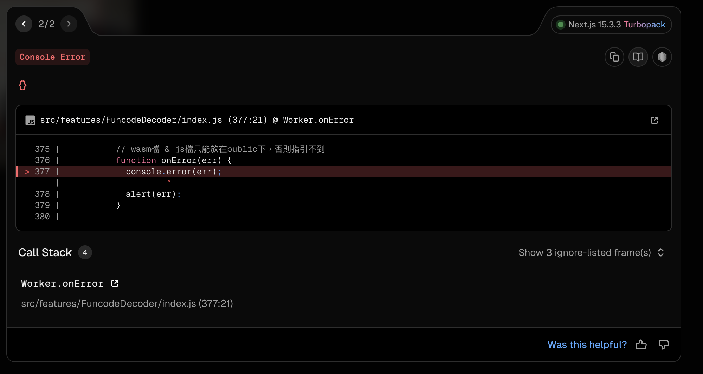

# Next.js Web Decoder

## 檔案架構

- `src/app/page.tsx`: 此為程式進入點，使用 `Reader` 來顯示解碼器。
- `src/features/FuncodeDecoder/index.tsx`: 此為解碼器的主組件，負責處理解碼邏輯，程式碼內容來自 Google Drive 提供的範例。

## 錯誤內容

### 無法讀取 localstorage

### 讀取 wasm 會報錯

